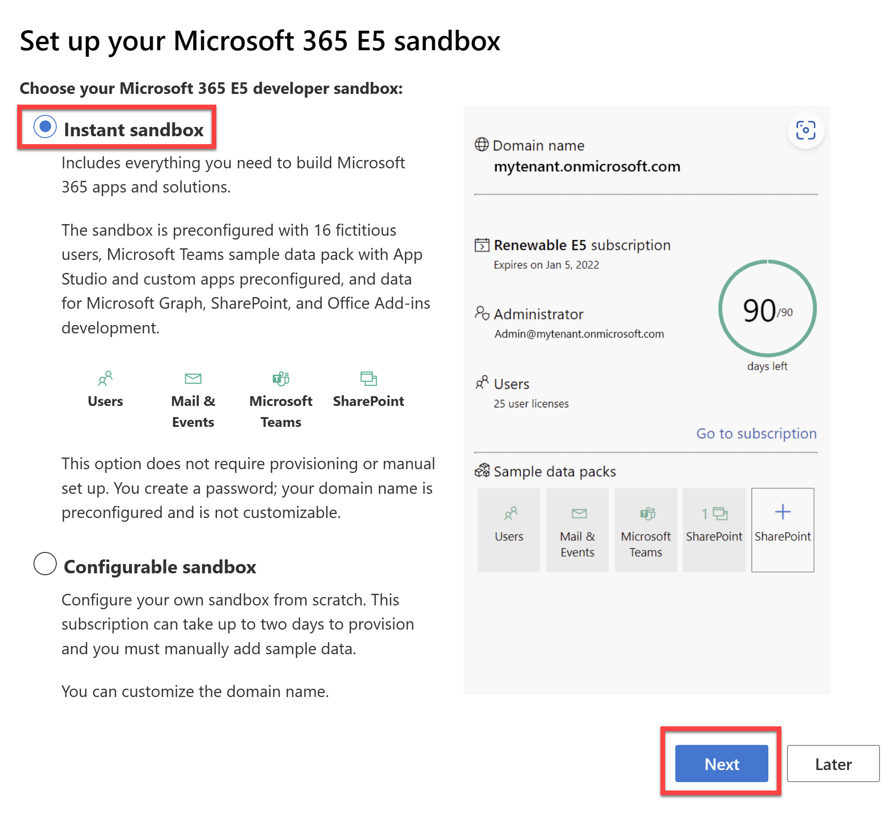
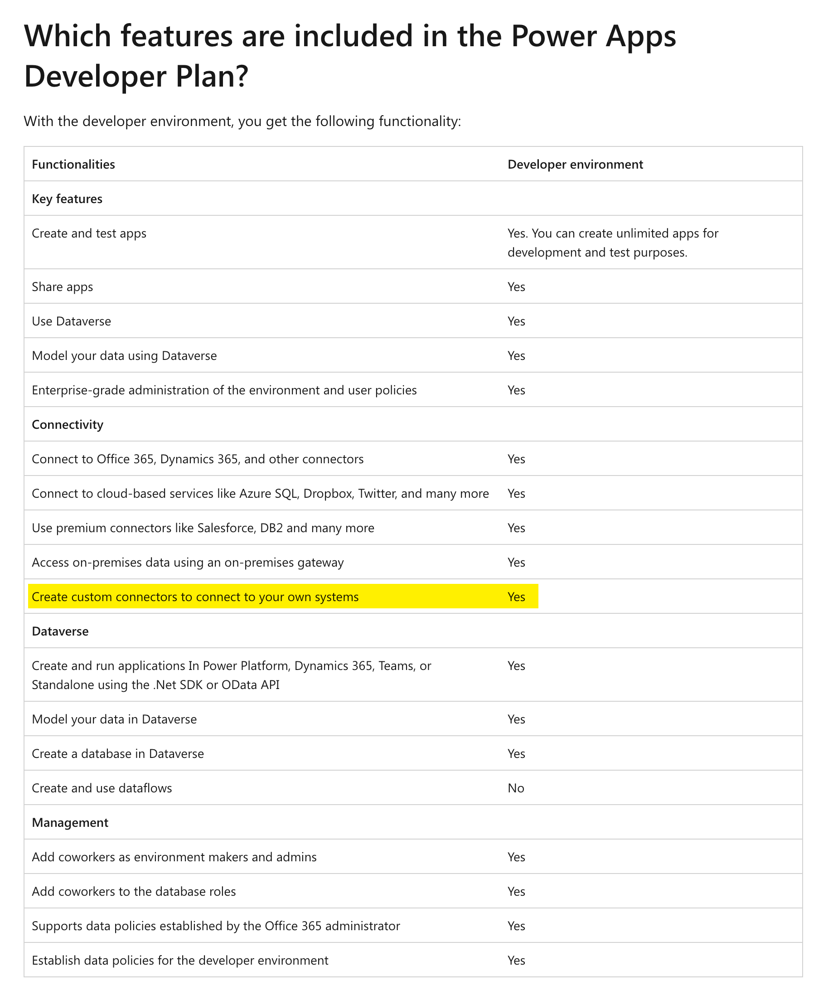
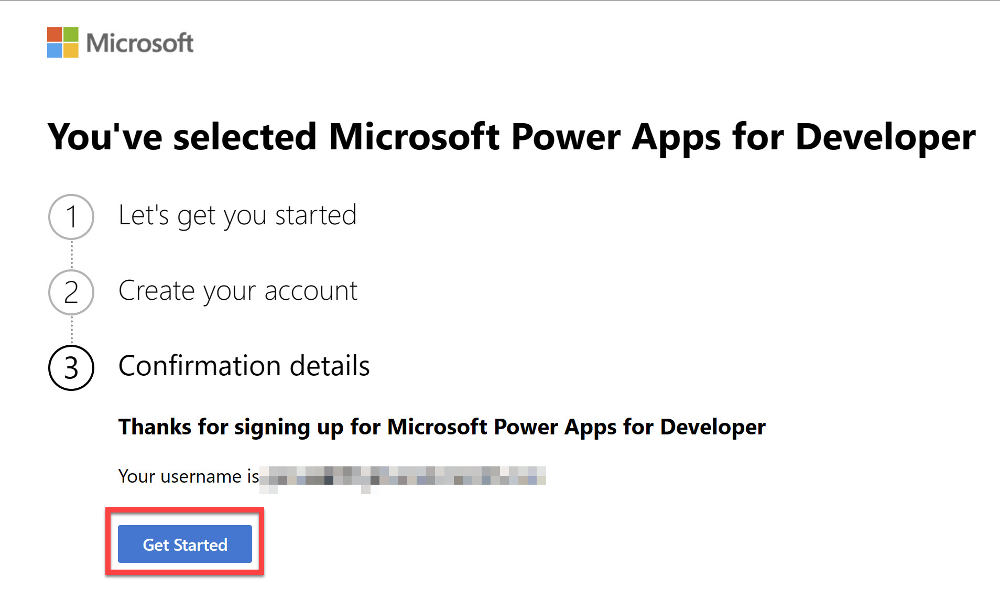
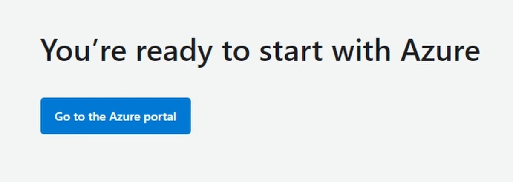

# Lab 0 - Setup your environment

> NOTE:
> 
> If you already have a Power Platform environment or an Azure account, you're more than welcome to use any of those for this workshop. However, be careful: when you are using an environment where you are not the admin, it could happen that you don't have enough rights to perform all actions. You could for instance run into a Data Loss Prevention (DLP) policy which could block the usage of the custom connector you are going to be building later in this workshop. If you're not an admin for your Azure account, you might be blocked from creating certain resources needed to complete this workshop as well. 

## Step 1: Create your own developer tenant

You can create your own developer tenant through the Microsoft 365 Developer Program. Go to the Microsoft 365 Developer Program website and make sure to register for a free 25-user tenant. When you are done creating the tenant, make sure to go to the next step.

1. Go to [developer.microsoft.com/microsoft-365/dev-program](https://developer.microsoft.com/microsoft-365/dev-program)
2. Click **Join Now**

3. Sign into your Microsoft account or Create a Microsoft account

> **Note**: If you’re creating a new account, you’ll need to validate the account with a phone number.

4. Complete the **Join the Microsoft 365 Developer Program!** form.
5. On the **Set up your Microsoft 365 E5 sandbox** page, make sure that *Instant sandbox* is selected and then click **Next**.

6. Finish setting up your *Instant sandbox* by choosing your country/region, admin username, and admin password. 

> **Note**: Make sure to note down / remember this admin password because this will be the password for your developer tenant.

7. Click **Continue**.
8. Provide a valid cell phone number and choose **Send code**. Enter the code that you receive, and then choose **Set up**.

> **Note**: You must use a valid cell phone number and not Voice over IP (VoIP). You can only have one Microsoft 365 Developer Program account associated with your phone number.

After the subscription is created, your subscription domain name and expiration date appear on your profile page.

9. Copy/Save the Administrator email address for signing into the Power Apps portal.

## Step 2: Add a Power Platform Developer account to the  Microsoft 365 Developer tenant you've just created

The Power Apps Developer Plan gives you a free development environment to build and test with Power Apps, Power Automate, and Microsoft Dataverse. In this workshop, the Power Apps Developer Plan enables you to also create a custom connector.

1. Go to [powerapps.microsoft.com/developerplan](https://powerapps.microsoft.com/developerplan).

2. Click **Get started free**.

3. For **Step 1**, enter your **M365 Dev Program** email address (the **Administrator email** address).

4. You should receive the following message:

Click **Sign in** and sign-in using your M365 Dev Program credentials (the **Administrator** email address and password).

5. After you sign in and complete the process, click **Get Started**.

6. After your licenses have been configured, you should automatically be redirected to [make.powerapps.com](https://make.powerapps.com/) - which is the Power Apps Portal.

## Step 3: Create an Azure account

The Java API, which will serve as the backend for what you'll be bulding in this workshop, will be hosted on Azure and in order to do that - you will need an Azure account. 

You can create an Azure account for free and receive 12 months of popular services for free and a $200 credit to explore Azure for 30 days - which is more than enough for this workshop.

1. Go to [azure.microsoft.com/free](https://azure.microsoft.com/free/) and click **Start Free**.

2. Sign into your Microsoft account

3. Fill in profile details to complete the sign up process. 

4. Once your information has been confirmed, you'll be ready to start with Azure.

### Next: [Lab 1 - Getting the Python API up and running in Azure](/Lab1/)
