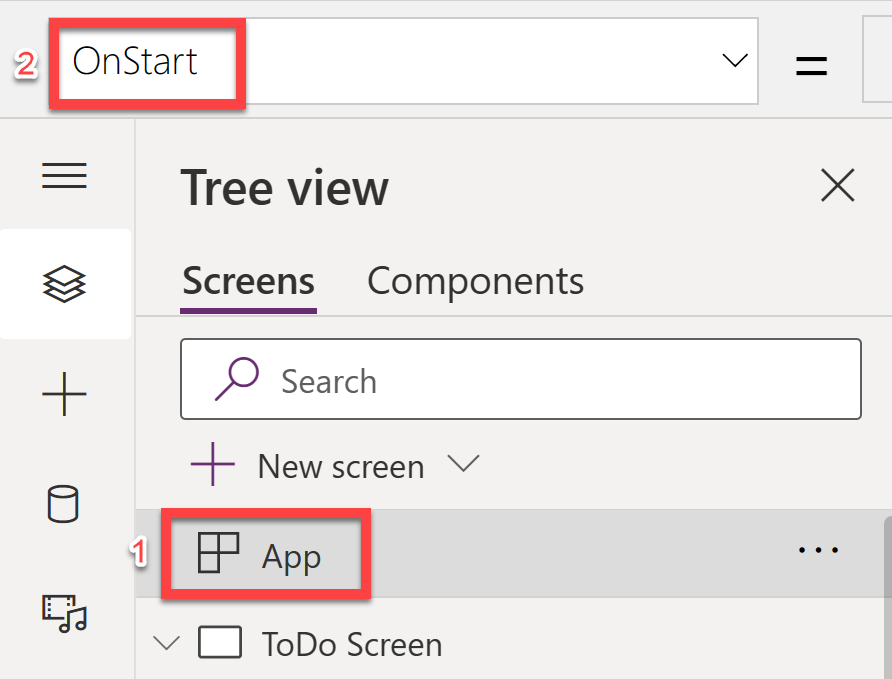
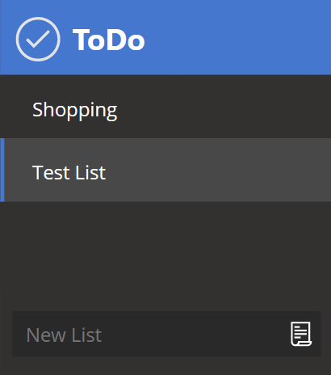
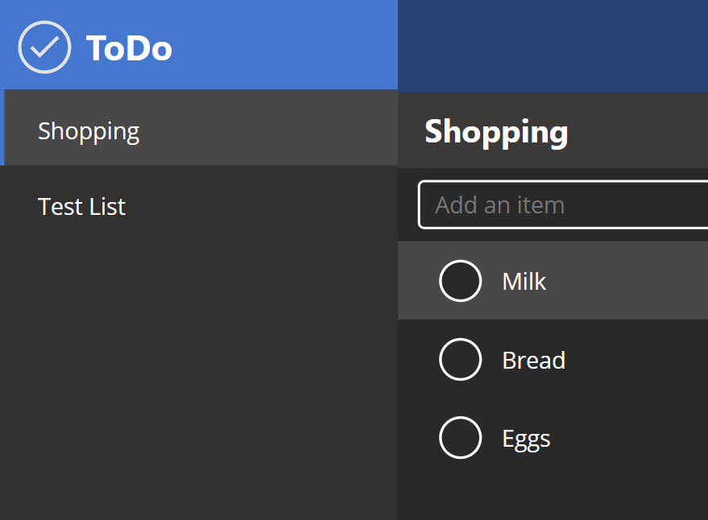
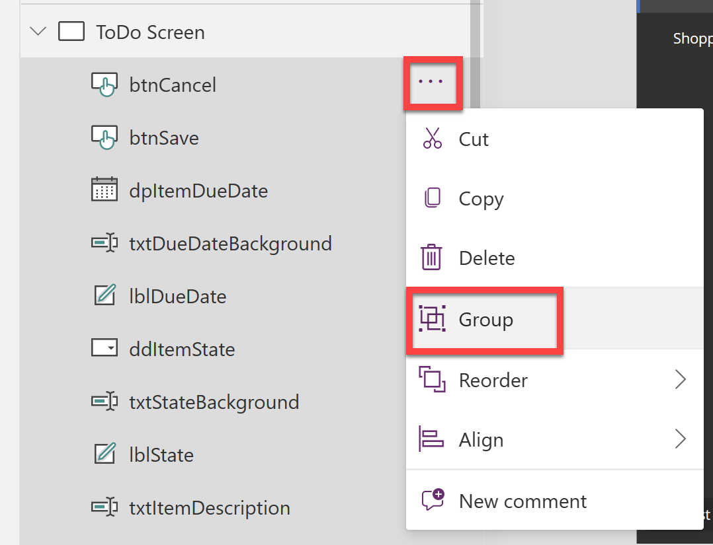
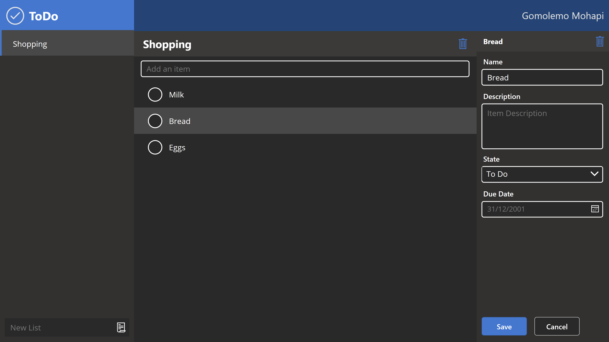

# Lab 6 - Adding data to a Power Apps Canvas App

In this lab, you'll be finally connecting the Custom Connector you created in the previous labs to the Canvas App you've just built.

Let's get a working app!

1. Go to [make.powerapps.com](https://make.powerapps.com) and sign in with the administrator email and password that you created in Lab 0.

Make sure that you're in the correct environment at the top right-hand side of the portal - it should be ```(Your name)'s Environment```. If not then click on the environment picker and change it to the correct one.

2. Click on **Solutions** in the left hand menu.

3. In the solution view, look for the ```Python + Power Workshop``` solution and then click on it's Display name.

4. Look for the ```Python ToDo App``` canvas app and then click on it's Display name to open the app in the Power Apps Studio.

## Configure OnStart

1. In the *Tree View*, click on **App**. Then using the *Properties list* drop down, select **OnStart**.



The **OnStart** property runs when the user starts the app. This property is often used to retrieve and cache data or set up global variables.

2. Copy this [Power Fx](https://learn.microsoft.com/en-us/power-platform/power-fx/overview) formula into the *formula bar* for the *OnStart* property:

```
ClearCollect(
    Lists,
    PythonToDo.GetLists()
);
Set(
    newListDefault,
    ""
);
Reset(galLists);
Set(
    currentList,
    First(Lists)
);
ClearCollect(
    currentListItems,
    PythonToDo.GetListItems(currentList.id)
);
Set(
    listItemFormVisibility,
    false
);
```

3. Once you've added the above formula, let's initialise the OnStart process by hovering over the **App** object in the **Tree view** pane, selecting ellipsis (...), and then selecting **Run OnStart**. 

4. **Save** your work.

## Configure the Lists Gallery

1. Select the *galLists* gallery and then configure the following properties:
    * Items: ```Lists```
    * Default: ```First(Lists)```

2. Select the *lblListName* control under *galLists* and then configure the following properties:
    * Text: ```ThisItem.name```
    * OnSelect:

    ```
    Select(Parent);
    Set(
        currentList,
        ThisItem
    );
    ClearCollect(
        currentListItems,
        JavaToDo.GetListItems(currentList.id)
    );
    Set(
        listItemFormVisibility,
        false
    )
    ```

The *galLists* control should now be displaying the *Shopping* list that you created in an earlier lab.


3. **Save** your work.

## Configure the New List functionality

1. Select the *txtAddList* control and set the following properties:
    * Default: ```newListDefault```
    * Reset: ```resetTxtAddList```

There will be an error after you've set the *Reset* property. No worries - it will be rectified in the next step.

2. Select the *icoAddList* control and set the *OnSelect* property to:

```
PythonToDo.CreateList(
    {
        id: GUID(),
        name: txtAddList.Text
    }
);
ClearCollect(
    Lists,
    PythonToDo.GetLists()
);
UpdateContext({resetTxtAddList: !resetTxtAddList});
UpdateContext({resetTxtAddList: !resetTxtAddList});
```

3. Then go on to set the *icoAddList* control's *Icon* property to:

```
If(
    txtAddList.Text = "",
    Icon.ListScrollWatchlist,
    Icon.Save
)
```

4. **Save** your work.

Test out the New List functionality by previewing the app and typing "Test List" in the *txtAddList* control. Notice how the *icoAddList* control changed to a *Save* button as soon as you started typing? 

When you're done typing, click on the *Save* button, and a new list should be populated in the *galLists* gallery. Also, the text in the *txtAddList* control will be cleared.



## Configure the *List Name* text label, List Items Gallery, amd the New List Item functionality

1. Select the *lblCurrentList* control and set the *Text* property to ```currentList.name```.

2. Select the *icoDeleteList* control and set the *OnSelect* property:

```
PythonToDo.DeleteList(currentList.id);
ClearCollect(
    Lists,
    PythonToDo.GetLists()
);
Reset(galLists);
Set(
    currentList,
    First(Lists)
);
ClearCollect(
    currentListItems,
    PythonToDo.GetListItems(currentList.id)
);
```

3. Select the *txtAddItem* control and set the *Reset* property to: ```resetTxtAddItem```.

4. Select the *icoAddItem* control and set the *OnSelect* property to:

```
PythonToDo.CreateListItem(
    currentList.id,
    GUID(),
    currentList.id,
    txtAddItem.Text,
    "todo"
);
ClearCollect(
    currentListItems,
    PythonToDo.GetListItems(currentList.id)
);
UpdateContext({resetTxtAddItem: !resetTxtAddItem});
UpdateContext({resetTxtAddItem: !resetTxtAddItem})
```

5. Select the *galListItems* gallery and then configure the following properties:       
    * Items: ```currentListItems```
    * Default: ```First(currentListItems)```

6. Select the *lblListItemName* control under *galListItems* and then configure the following properties:
    * Text: ```ThisItem.name```
    * OnSelect:

    ```
    Select(Parent);
    Set(
        currentListItem,
        ThisItem
    );
    Set(
        listItemFormVisibility,
        true
    )
    ```

7. Select the *cirCheckMark* control under *galListItems* and then configure the following properties:
    * Fill: ```If(ThisItem.state="todo",RGBA(41,41,41,1),RGBA(0,0,0,0))```
    * OnSelect:

    ```
    Select(Parent);
    Set(
        currentListItem,
        ThisItem
    );
    Set(
        listItemFormVisibility,
        true
    )
    ```

With these controls configured - you can now see existing List items and add additional ones. You can also delete lists. Go ahead and test it out. 

Click on the *Shopping* list and see the list items that you added way back in Lab 2: 



Click on the *Test List* list and add the following items:
* Test1
* Test2
* Test3

You should now have all 3 of the above items in your *Test List* list. Weird names for list items, right? That's because you're going to test the delete list icon. 

Make sure that *Test List* list is selected, then click on the delete icon above the list items. Once you've done this, the *Test List* list and it's items will be deleted and disappear from the screen.

## Configure the form for editing list item details.

1. First we need to group all the controls that make up our "form" for editing list items. Press and hold the ```ctrl``` button on your keyboard and then select these 15 controls in your *Tree View*:
    


2. With all 15 controls selected, click **More Options (...)** on the first control and then select **Group**.



3. Rename ```Group1``` to ```UpdateListItemGroup```

4. Make sure that ```UpdateListItemGroup``` is selected and then change it's *Visible* property to ```listItemFormVisibility```.

After changing the *Visible* property, the group might disappear from your app. To make it reappear, just select a list with list items and then select a list item.

The idea here is that when you select a list item: this form should appear where you'll be able to update any of the list item's details. Let's get that set up right now. 

## Configure the the *UpdateListItemGroup* controls.

1. Expand the *UpdateListItemGroup* and select the **lblCurrentItem** control and set the following properties:
    * Text: ```txtItemName.Text```

This will make the **lblCurrentItem** control empty at the moment because the **txtItemName** control is also empty. This will be fixed in the following steps.

2. Select the **icoDeleteItem** control and set the following properties:
    * OnSelect: 

    ```
    PythonToDo.DeleteListItem(
        currentListItem.listId,
        currentListItem.id
    );
    ClearCollect(
        Lists,
        PythonToDo.GetLists()
    );
    Reset(galLists);
    Set(
        currentList,
        First(Lists)
    );
    ClearCollect(
        currentListItems,
        PythonToDo.GetListItems(currentList.id)
    );
    Set(
        listItemFormVisibility,
        false
    );
    ```

3. Select the **txtItemName** control and set the following properties:
    * Default: ```currentListItem.name```

4. Select the **txtItemDescription** control and set the following properties:
    * Default: ```currentListItem.description```

5. Select the **ddItemState** control and set the following properties:
    * Default: ```If(currentListItem.state = "done", "Done", "To Do")```

6. Select the **dpItemDueDate** control and set the following properties:
    * DefaultDate: ```If(currentListItem.dueDate <> Blank(), currentListItem.dueDate, Blank())```

7. Select the **btnSave** control and set the following properties:
    * OnSelect:

    ```
    PythonToDo.UpdateListItem(
        currentListItem.listId,
        currentListItem.id,
        currentListItem.id,
        currentListItem.listId,
        txtItemName.Text,
        If(
            ddItemState.SelectedText.Value = "To Do",
            "todo",
            "done"
        ),
        {
            description: txtItemDescription,
            dueDate: Text(
                DateTimeValue(dpItemDueDate.SelectedDate),
                "yyyy-mm-ddThh:mm:ss.fffZ"
            )
        }
    );
    ClearCollect(
        currentListItems,
        PythonToDo.GetListItems(currentList.id)
    );
    Set(
        listItemFormVisibility,
        false
    );
    ```

8. Select the **btnCancel** control and set the following properties:
    * OnSelect: 
    ```
    Set(
        listItemFormVisibility,
        false
    );
    ```

9. **Save** your work.

And now you're DONE! You've now built the full solution. Go ahead and test your app! Add lists, list items, delete them, edit them, and have fun with your Power App. 




